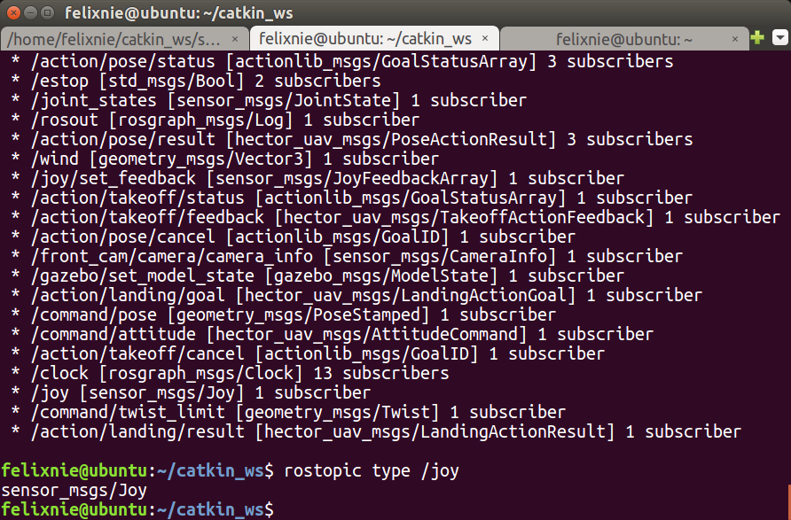
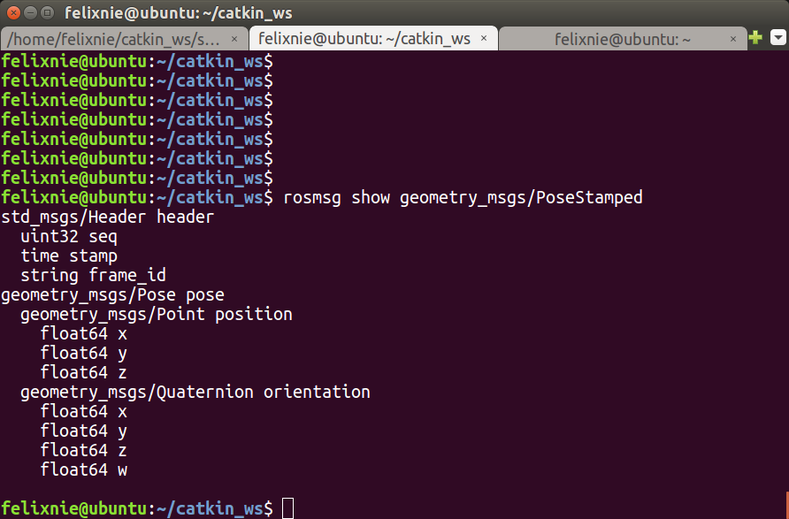

The goal is to automatically control a quadrotor to fly at the velocity we want.

First let us recap how to run a flight demo. We need to open 3 terminal windows:

The first one is for launching the outdoor flight demo. Begin with sourcing the bash:
~~~shell
cd catkin_ws/
source devel/setup.bash
roslaunch hector_quadrotor_demo outdoor_flight_gazebo.launch
~~~

The second one is to enable the motors so that they can be controlled by the controllers (joystick, keyboard, etc.). Also, this should be run after you sourcing the bash:
~~~shell
cd catkin_ws/
source devel/setup.bash
rosservice call \enable_motors true
~~~

The third window is to run the teleop_twist_keyboard so that we can control the quadrotor using keyboard. This package can be installed using apt-get install:
~~~shell
sudo apt-get install ros-kinetic-teleop-twist-keyboard
~~~
or just clone from its GitHub repository:
~~~shell
git clone https://github.com/ros-teleop/teleop_twist_keyboard.git
~~~
You may find there're only one Python script. Actually, what we can do is just modify the teleop_twist_keyboard.py. By running the package, you're just running this piece of code:
~~~shell
rosrun teleop_twist_keyboard teleop_twist_keyboard.py
~~~

## Installing VScode

To debug this Python code, we need to set up a development environment. I tried PyCharm but it cannot run teleop_twist_keyboard.py perfectly. Visual Studio Code then becomes the best choice.
To install VScode on Ubuntu, please go to https://code.visualstudio.com/Download

## About PYTHONPATH

The first thing to do is to identify which Python interpreter are we using to run teleop_twist_keyboard.py. We're definitely not going to choose a random one, since ROS has installed a bunch of libraries and packages inside the path of the interpreter it uses.

Usually there are three main interpreters that ROS uses. It's identified by the global variable $PYTHONPATH. We can see the difference before and after you source any ROS workspace:
~~~shell
echo $PYTHONPATH
bash: /opt/ros/kinetic/lib/python2.7/dist-packages: Is a directory
~~~
After sourcing a workspace, like hector_ws:
~~~shell
echo $PYTHONPATH
/home/hongtuo/hector_ws/devel/lib/python2.7/dist-packages:/opt/ros/kinetic/lib/python2.7/dist-packages
~~~
So always keep in mind which Python interpreter is being used!

Here since we need to debug the teleop_twist_keyboard.py file, we need to know which Python environment it's using. This env will include basic ROS Python packages like roslib. By adding these code we can get the Python path and version info:
~~~shell
    import sys
    import os
    print('This is an experimental version. Modified by Felix Nie.')

    print('Current Python exec path:')
    print(sys.executable)
    print("Current Python version:")
    print (sys.version)
~~~
The output is:
~~~shell
hongtuo@t-5810:~/teleop_twist_keyboard$ python teleop_twist_keyboard.py 
This is an experimental version. Modified by Felix Nie.
Current Python exec path:
/usr/bin/python
Current Python version:
2.7.12 (default, Jul 21 2020, 15:19:50) 
[GCC 5.4.0 20160609]
~~~

## Setting up IDE

We need a IDE for convenience. PyCharm seems not to be able to run ioctl related code. Let's choose VSCode.
We need to set Python interpreter to **/usr/bin/python** in VSCode.
Follow this guide to set everything up:
https://marketplace.visualstudio.com/items?itemName=ms-python.python

## Understanding hector_quadrotor

There're several commands we're going to use frequently in this chapter.
~~~shell
rostopic list -v
rostopic type TOPICNAME
rosmsg show TYPENAME
rostopic echo TOPICNAME
~~~

{:.lead width="800" height="100" loading="lazy"}

The full list of topic:

Please refer to [Output]{:.heading.flip-title}.

The full list of **rostopic** and **rosmsg** commands:
~~~shell
	rostopic bw	display bandwidth used by topic
	rostopic delay	display delay of topic from timestamp in header
	rostopic echo	print messages to screen
	rostopic find	find topics by type
	rostopic hz	display publishing rate of topic    
	rostopic info	print information about active topic
	rostopic list	list active topics
	rostopic pub	publish data to topic
	rostopic type	print topic or field type

	rosmsg show	Show message description
	rosmsg info	Alias for rosmsg show
	rosmsg list	List all messages
	rosmsg md5	Display message md5sum
	rosmsg package	List messages in a package
	rosmsg packages	List packages that contain messages
~~~

## Fetching position of a quadrotor

We can fetch the ground truth of a quadrotors's position and orientation with the commands above, listening to the topic **/ground_truth_to_tf/pose**, of which the type is **geometry_msgs/PoseStamped**. We can take a look at its data structure:

{:.lead width="800" height="100" loading="lazy"}

Then we can fetch the position information of a quadrotor by:
~~~shell
rostopic echo /ground_truth_to_tf/pose
~~~
It will look like this:
~~~shell
header: 
  seq: 93341
  stamp: 
    secs: 933
    nsecs: 421000000
  frame_id: "world"
pose: 
  position: 
    x: 6.52369435648
    y: -7.9102266541
    z: 0.266923661311
  orientation: 
    x: 0.037585662434
    y: 0.0017887777765
    z: -0.999291794003
    w: -0.000169386832415
---
header: 
  seq: 93342
  stamp: 
    secs: 933
    nsecs: 431000000
  frame_id: "world"
pose: 
  position: 
    x: 6.5236768609
    y: -7.91021347608
    z: 0.266921106179
  orientation: 
    x: 0.0376316518711
    y: 0.00175557932743
    z: -0.999290121657
    w: -0.000171688159614
---
header: 
  seq: 93343
  stamp: 
    secs: 933
    nsecs: 441000000
  frame_id: "world"
pose: 
  position: 
    x: 6.52369411247
    y: -7.91022759181
    z: 0.266925983107
  orientation: 
    x: 0.0375830424206
    y: 0.00179585880944
    z: -0.999291880182
    w: -0.000167381804471
~~~

Although the position data with time stamps is already enough for us to derive the velocity of the quadrotor, we cannot continue our work like trajectory design without understanding quaternion - a way for computers to understand orientation. This is totally different from Euler angles and orthogonal matrix.

Please keep reading [Quaternion]{:.heading.flip-title}.

## To control with velocity

The basic idea of controlling a quadrotor is based on the feedback of a localization system like OptiTrack. The localization system send the position and orientation to the ground station, then compare with the goal or points on the designed trajectory of the robots to derive the velocity. The velocity is then send to the robot.

If you are doing collision avoidance when the quadrotor is simultaneously controlled by human operator with a joystick, the velocity is the combination of joystick command and the potential field vectors.

In ROS, the joystick signal is represented by the topic **/cmd_vel**, which is a **geometry_msgs/Twist** data. This expresses velocity in free space broken into its linear and angular parts:

~~~shell
geometry_msgs/Vector3 linear
geometry_msgs/Vector3 angular
~~~

For more information, we need to read the code inside teleop_twist_keyboard.py. (will continue)

[output]: output.md
[quaternion]: quaternion.md
